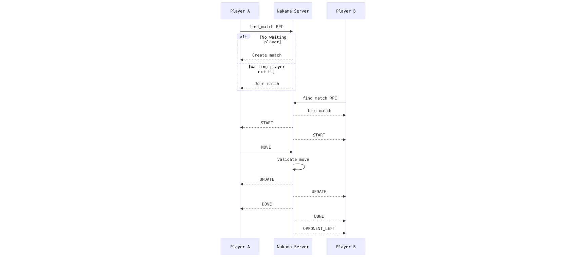

# Multiplayer Tic-Tac-Toe

Real-time multiplayer Tic-Tac-Toe with a **server-authoritative** backend: game rules, turns, and outcomes live entirely in a [Nakama](https://heroiclabs.com/nakama/) Go runtime plugin; the React + TypeScript client only renders state and sends moves over WebSockets. Matchmaking is an RPC-backed FIFO queue; the focus is reliable lifecycle handling and consistent game state for both players under adverse conditions.

---

## Tech Stack

| Layer | Technology |
|---|---|
| Frontend | React, TypeScript, Vite, Tailwind CSS |
| Backend | [Nakama](https://heroiclabs.com/nakama/) with Go runtime plugin |
| Database | PostgreSQL (managed by Nakama) |
| Realtime | WebSockets (Nakama socket API) |
| Matchmaking | Custom RPC (`find_match`) + in-memory waiting match id |
| Deployment | [Vercel](https://vercel.com) (frontend) · [DigitalOcean](https://www.digitalocean.com/) (Nakama + Postgres) |

---

## Local Setup

### Prerequisites

- [Node.js](https://nodejs.org/) and [pnpm](https://pnpm.io/)
- [Docker](https://www.docker.com/) and Docker Compose

### Clone and run the frontend

```bash
git clone https://github.com/muteenk/realtime-multiplayer-tictactoe.git
cd realtime-multiplayer-tictactoe/frontend
pnpm install
```

Create `frontend/.env.local` so Vite can reach Nakama (values are embedded at build time; see `frontend/src/lib/nakama/client.ts`):

```env
VITE_NAKAMA_HOST=127.0.0.1
VITE_NAKAMA_SSL=false
```

For a remote HTTPS host: set `VITE_NAKAMA_SSL=true` and the correct hostname. Port defaults to `443` when SSL is enabled.

```bash
pnpm dev
```

App is served at `http://localhost:5173`.

### Run Nakama + PostgreSQL (backend)

```bash
cd backend_go
docker compose up --build
```

- **HTTP API / WebSocket:** `http://127.0.0.1:7350`
- **Console:** `http://127.0.0.1:7351` (credentials in `backend_go/local.yml`)

After changing Go code, rebuild the plugin and restart:

```bash
docker compose run --rm builder
docker compose restart nakama
```

---

## Deployment

| Piece | Platform | Live URL |
|---|---|---|
| Frontend | [Vercel](https://vercel.com) | [realtime-multiplayer-tictactoe.vercel.app](https://realtime-multiplayer-tictactoe.vercel.app/) |
| Nakama + PostgreSQL | [DigitalOcean](https://www.digitalocean.com/) | [tictactoe.jiroshi.com](https://tictactoe.jiroshi.com/) |

The backend is served on a subdomain of **`jiroshi.com`** - a personal domain already in use - to avoid registering a separate domain for this project.

**Production frontend env (Vercel):** set `VITE_NAKAMA_HOST=tictactoe.jiroshi.com` and `VITE_NAKAMA_SSL=true`. Redeploy after changing `VITE_*` vars so Vite embeds the updated values.

**Health check:** the `health_check` RPC (`POST /v2/rpc/health_check`) returns `{"status":"ok"}` and is suitable for uptime monitoring or waking a cold-start instance.

---

## Architecture

The server owns all game state. Clients send intent; the server validates, mutates, and broadcasts. The frontend is a thin render layer over socket messages and RPC responses - it holds no authoritative state.



| Opcode | Name | Direction | Role |
|---|---|---|---|
| 1 | `START` | Server → Client | Match started; carries initial board and mark assignments |
| 2 | `UPDATE` | Server → Client | Board state after a valid move |
| 3 | `DONE` | Server → Client | Game over (includes winner or draw) |
| 4 | `MOVE` | Client → Server | Player submits a move |
| 5 | `REJECTED` | Server → Client | Move was illegal (wrong turn, occupied cell) |
| 6 | `OPPONENT_LEFT` | Server → Client | Other player disconnected |

---

## Backend Design

The backend is built so **truth lives in one place**: the server decides what is legal, what the board is, and when a match ends. Clients are untrusted inputs, not co-equal peers.

- **Server-authoritative by default** - Move validation, turn enforcement, and win/draw detection run only in the Go match handler. A modified client cannot force illegal wins or skip turns. This is the primary correctness guarantee, not a security afterthought.

- **Nakama's match lifecycle as the control spine** - All state transitions (join, tick, leave, termination) flow through `MatchInit` → `MatchLoop` → `MatchLeave`. There is no separate state machine or hand-rolled cleanup logic. This makes "what happens when someone drops?" a tractable question with a single answer: `MatchLeave` fires, the remaining player is notified, and the match is torn down.

- **Intentionally minimal matchmaking (`WaitingMatchId`)** - For 1v1, a FIFO queue is sufficient: the first caller creates a match and waits; the second caller consumes it. No external matcher service, no extra failure surface, and no ambiguity about stale lobbies. The tradeoff - no skill-based or preference-based pairing - is acceptable for this scope.

- **Explicit phases: playing → game over → terminated** - `gameRunning` and `gameOver` are distinct flags. Once a result exists, the server stops accepting moves and the match ends cleanly. This prevents ambiguous half-open games and ghost matches.

- **Reject early, apply never** - Invalid input (wrong turn, occupied square, moves after game over) returns `REJECTED` and does not touch match state. The board changes only on paths the server has validated.

---

## Engineering Challenges

This is not a tutorial CRUD app. The non-trivial parts:

- **Consistency across two concurrent WebSocket streams** - Both players must see identical board state at all times. The server is the single writer; every `UPDATE` is a broadcast from a validated state transition, not a merge of two clients' views. Achieving this with Nakama's tick-based `MatchLoop` requires careful sequencing of reads and writes within a single goroutine.

- **Lifecycle correctness under disconnect** - Players can drop at any point: during matchmaking, mid-game, or between rounds. Each scenario requires a different cleanup path. `MatchLeave` fires reliably, but the server must distinguish "player left intentionally" from "player will reconnect" - and currently it cannot (see Known Limitations).

- **State divergence prevention** - The client sends a move and immediately shows a pending indicator, but the board does not update until the server broadcasts `UPDATE`. If the server rejects the move (or the message is lost), the client reverts. This eliminates the class of bugs where two clients reach different board states.

---

## Known Limitations

These are deliberate scoping decisions, not oversights:

- **No reconnection after disconnect** - If a player's connection drops mid-game, they cannot rejoin the same match. The opponent is immediately notified and the match is abandoned. Reconnection would require match state persistence and a re-join handshake, neither of which is implemented.

- **Matchmaking state is in-memory and single-node** - The `WaitingMatchId` is a Go-level variable on one server instance. It is not persisted or coordinated across processes. Restarting Nakama loses any pending lobby. Two concurrent find-match requests on different instances would never pair.

- **No match persistence** - Match history, results, and board snapshots are not written to the database. There is no replay, statistics, or audit trail.

- **No authentication beyond device ID** - Players are identified by a randomly generated device ID. There is no account system, no access control, and no way to prevent a player from impersonating a different device ID.

---

## Scalability Considerations

The current architecture is intentionally single-node. Here is what breaks at scale:

- **In-memory matchmaking does not survive restarts or scale horizontally.** `WaitingMatchId` is a process-local variable. Two `find_match` RPC calls landing on different Nakama instances will never pair. A Redis-backed atomic compare-and-swap (or Nakama's built-in matchmaker) would be needed for multi-instance deployments.

- **Match state lives in the Nakama process, not in the database.** Each match is an in-memory Go struct. Horizontal scaling would distribute matches across instances, but there is no shared state layer. A player reconnecting to a different instance would find no match to rejoin.

- **No backpressure or rate limiting on move submissions.** A fast client can flood the match loop. This is tolerable for two players, but any fan-out design (spectators, larger lobbies) would need message queuing and per-player rate limiting.

- **The tick rate is fixed.** `MatchLoop` runs at a constant tick rate regardless of whether there is anything to process. For a small number of concurrent matches this is fine; at scale, idle-match CPU overhead becomes meaningful.

---

## Future Improvements

Ordered roughly by impact:

1. **Distributed matchmaking via Redis or Nakama's built-in matchmaker** - Replace `WaitingMatchId` with an atomic Redis key or delegate pairing to Nakama's matchmaker API. This is the first thing to fix before any horizontal scaling attempt.

2. **Reconnection** - Persist match state to the database at phase transitions. Add a `rejoin_match` RPC that looks up a player's active match and reissues a `START` message with current state. This requires a match-id-to-player-id index and a grace period before `OPPONENT_LEFT` is broadcast.

3. **Match persistence and history** - Write completed matches (result, move log, timestamps) to PostgreSQL. Enables leaderboards, replay, and debugging of production issues.

4. **Optimistic UI with server reconciliation** - Apply moves locally on click and reconcile with the authoritative `UPDATE`. Reduces perceived latency on high-latency connections. Requires rollback logic on `REJECTED`, which adds complexity but is a well-understood pattern.

5. **Horizontal scaling strategy** - Sticky sessions (route a player to the instance hosting their match) plus a Redis-backed match registry. Long-term: migrate match state to a shared store so any instance can handle any player's connection.

---

## Edge Cases Handled

- Invalid moves (wrong turn, occupied cell) - rejected server-side, client state unchanged.
- Disconnect mid-game - remaining player receives `OPPONENT_LEFT` immediately.
- Lobby leave before opponent joins - waiting match reference is cleared and the match is terminated.
- Moves after game over - server ignores them; `gameRunning` gate blocks processing.
- Two-player cap - enforced in `MatchJoinAttempt`; a third join is rejected.

---

## Demo

Real-time play, matchmaking, win/draw, and disconnect handling: [Video walkthrough](https://drive.google.com/file/d/1LS-KzY6qAiPPnPi81B3QwoFFbrTnDFEf/view?usp=sharing)

---

## Notes

This project prioritises correctness and lifecycle reliability over feature breadth. The implementation surface is deliberately small: one authoritative match handler, one RPC for matchmaking, and a thin React client. Every design decision is made to keep the system predictable to run and straightforward to extend.
